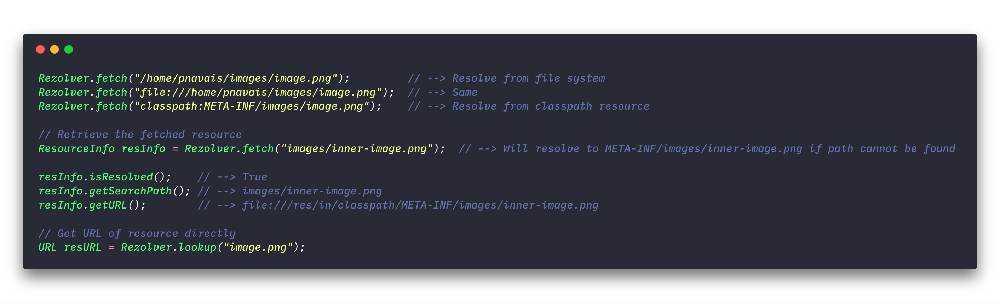

<p align="center">
    <!---->
    
</p>

<p align="center">
    <a href="https://travis-ci.org/pnavais/rezolver">
        
    </a>
    <a href="https://coveralls.io/github/pnavais/rezolver?branch=master">
        
    </a>
     <a href="LICENSE">
       
    </a>
        <a href="https://sonarcloud.io/dashboard/index/org.payball:rezolver">
        
    </a>
</p>

<p align="center"><sup><strong>Simple resource locator for Java 8</strong></sup></p>

<h2>Resolving the location of a given resource using the default chain of loaders.</h2>
<p>
Rezolver will try to do its best to resolve the correct URL of any
arbitrary resource specified using a string URL that can be either relative
or absolute containing optionally a full valid schema.
</p>



In order to retrieve the resolved URL of a given resource, Rezolver will use
a default chain of loaders performing the following steps :
<ol>
<li>Use the local loader to check that the specified resource location string refers to a file in the local
   file system.</li>
<li>Use the classpath loader to check if the specified resource location string refers to a path relative
    to the current application classpath (META-INF will be used as fallback folder in the classpath).</li>
<li>Use a remote loader to check if the specified resource location string refers to a valid URL</li>
</ol>

<h2>Creating a custom chain of loaders</h2>

Use the ResourceBuilder to customize the loaders resolution chain :
```Java
// A custom chain looking first locally and later in the classpath in case of failure (META-INF/resources is used as fallback folder)
Rezolver r = Rezolver.builder()
                     .add(new LocalLoader())
                     .add(FallbackLoader.of(new ClasspathLoader(), "META-INF/resources")))
                     .build();
                     
r.resolve("inner-resource.conf").getURL(); // --> Will retrieve file:///res/in/classpath/META-INF/resources/inner-resource.conf
```
---


<div><sup>Icon made by <a href="http://www.flaticon.com/authors/pixel-buddha" title="Pixel Buddha">Pixel Buddha</a> from <a href="http://www.flaticon.com" title="Flaticon">www.flaticon.com</a> is licensed by <a href="http://creativecommons.org/licenses/by/3.0/" title="Creative Commons BY 3.0" target="_blank">CC 3.0 BY</a></sup></div>

